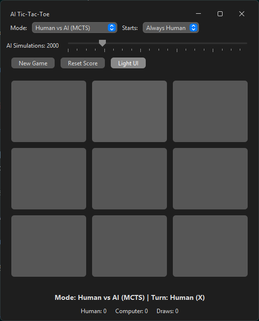

# Educational Tic-Tac-Toe AI

[](LICENSE)


An educational Java Swing project that helps students compare two different ways a computer can appear "intelligent" in a game:

- a deterministic algorithm that always calculates the optimal move
- a simulation-based AI that improves through repeated trials and controlled randomness
- a scalable ruleset that extends the game from `3x3` up to `6x6`



## Why This Project Exists

This project was built as a teaching tool.

Its purpose is not only to provide a playable Tic-Tac-Toe game, but also to help students understand:

- what an algorithm is in practice
- what classical game AI looks like without machine learning
- how different decision-making approaches produce different behavior
- why game AI is sometimes intentionally designed to be imperfect

The central teaching question is simple:

**What is the difference between an exact algorithmic opponent and an AI opponent that behaves intelligently through search and simulation?**

## Educational Focus

This project is designed to show three ideas clearly.

### 1. Deterministic algorithmic intelligence

The `Human vs Algo` mode uses **Minimax**.

Minimax explores the game tree, evaluates all relevant outcomes, and chooses the mathematically best move. For Tic-Tac-Toe, this means:

- perfect play
- no avoidable mistakes
- predictable and repeatable behavior

This is useful for teaching what a solved game looks like when a computer uses exact search.

For larger boards, the same mode transitions into **heuristic alpha-beta search** instead of full exact search. This is also educational, because it shows students where exact search stops being practical and where evaluation heuristics become necessary.

### 2. Simulation-based AI behavior

The `Human vs AI` mode uses **Monte Carlo Tree Search (MCTS)**.

Instead of solving the entire game tree exactly, MCTS:

1. selects promising states
2. expands the search gradually
3. runs simulated games
4. uses those results to guide future decisions

This makes it a strong example of classical AI based on:

- search
- simulation
- probabilistic decision making

It does not use:

- machine learning
- neural networks
- training data

This is important for students, because it shows that "AI" is broader than modern ML.

### 3. Artificial Stupidity

This project also demonstrates a practical game-AI concept often called **Artificial Stupidity**.

The term is commonly used in game AI to describe a deliberate design choice: instead of making an opponent as strong as possible at all times, the developer intentionally limits or perturbs its behavior so that it becomes more understandable, more adjustable, or simply more enjoyable to play against.

For background, see:

- [Artificial stupidity - Wikipedia](https://en.wikipedia.org/wiki/Artificial_stupidity)

Why does this idea exist?

- because perfectly rational opponents are not always the most useful for teaching
- because "maximum strength" and "best player experience" are not the same thing
- because difficulty levels need to feel meaningfully different to the user
- because in many games, believable imperfection creates a more natural experience than robotic perfection

In small games such as Tic-Tac-Toe, even a low-budget MCTS can become very strong very quickly. If the AI always chooses the strongest move it finds, the lower settings stop feeling like lower settings.

That creates an educational problem:

- students do not clearly see the difference between approximate AI and exact search
- the slider appears to change numbers more than behavior
- the contrast with Minimax becomes weaker

To solve that, this project introduces **controlled imperfection** through a dedicated **Artificial Stupidity** setting.

The key idea is this:

- the AI still performs real MCTS search
- the search results still matter
- the simulation budget still controls how much search work is done
- Artificial Stupidity can be enabled or disabled entirely
- when it is enabled, a separate Artificial Stupidity level controls how strongly the final move selection is softened

When Artificial Stupidity is **off**, the implementation uses its strongest hybrid behavior and keeps a tactical safety layer for MCTS:

- immediate winning moves are always taken
- immediate losing replies are avoided when a safe alternative exists
- open-ended tactical threats are handled more aggressively

This keeps the strongest MCTS mode from looking arbitrarily blind in obvious tactical positions.

When Artificial Stupidity is **on**, those teaching-oriented imperfections are allowed again.

At higher Artificial Stupidity settings, the AI is more willing to:

- choose among several strong moves probabilistically
- behave less deterministically
- remain beatable and easier to compare against Minimax

At lower Artificial Stupidity settings, the behavior is still softened, but much less aggressively.

So the practical interpretation is:

- **AS Off**: strongest version of this project’s MCTS, with tactical guardrails enabled
- **AS On + Super Low**: only a small amount of visible imperfection
- **AS On + Extra High**: the loosest, most visibly imperfect behavior

This is not a bug and it is not "fake AI". It is a teaching-oriented application of Artificial Stupidity: the intelligence is real, but the final behavior is shaped so that students can more clearly observe the tradeoff between strength, approximation, and playability.

## Game Modes

### Human vs Algo (Minimax)

Use this mode to demonstrate:

- perfect adversarial search
- deterministic decision making
- what "optimal play" means in a solved game
- how algorithmic search changes when the board becomes too large for exact analysis

Expected outcome:

- on `3x3`, the computer should never lose and the best human result is a draw
- on larger boards, the mode remains algorithmic, but uses heuristic depth-limited search instead of perfect full-tree search

### Human vs AI (MCTS)

Use this mode to demonstrate:

- simulation-driven search
- approximate rather than exact decision making
- how additional computation can improve behavior

The MCTS controls are split into two ideas:

- **Simulations**: how much search work the algorithm performs
- **Artificial Stupidity**: whether controlled imperfection is enabled, and if so, how strongly it is applied after the search is finished

There are now two parts to this control:

- **Enable Artificial Stupidity** checkbox
- **Artificial Stupidity** level slider

When the checkbox is **off**, MCTS runs in its strongest project configuration:

- the teaching-oriented imperfection layer is disabled
- tactical guardrails remain active
- the behavior should be sharper and more consistent

When the checkbox is **on**, the slider controls how much visible imperfection is allowed after the search.

- lower values: only slight softening of the final choice
- higher values: much looser and more visibly imperfect play

Artificial Stupidity levels are:

- `Super Low`: almost no added imperfection
- `Low`
- `Medium`
- `High`
- `Extra High`: the loosest, most visibly imperfect setting

Because this project includes controlled imperfection at low settings, this mode also helps explain why game AI is often designed for **believability and adjustability**, not only maximum strength.

### PC vs PC

Use this mode to demonstrate:

- algorithm-versus-algorithm observation without human interaction
- side-by-side comparisons such as `Algo vs MCTS` or `MCTS vs MCTS`
- how board size, simulation budget, and move cadence affect visible behavior
- how telemetry accumulates during long automated runs

The user can configure:

- the strategy for `X`
- the strategy for `O`
- separate `X Bot` and `O Bot` setup panels
- separate MCTS simulation counts for each side when needed
- separate Artificial Stupidity levels for each MCTS side when needed
- autoplay speed from slow observation to fast automated play
- manual `Start` / `Pause` control so the mode stays idle until the user explicitly starts the match

This mode is especially useful together with the `Algorithm Monitor`, because it produces clean comparative data without requiring user play.

### Levels and win conditions

The game supports levels from `3x3` to `6x6`.

The ruleset is:

- `3x3` uses the classic `3x3` board with `3 in a row` to win
- `4x4` through `6x6` use a larger `10x10` board
- the selected level tells the player how many marks are needed in a row to win

Examples:

- `4x4` means `4 in a row` on a `10x10` board
- `6x6` means `6 in a row` on a `10x10` board

This produces more open positions, fewer early draw states, and a more interesting strategy space than using literal `4x4`, `5x5`, or `6x6` boards.

## Minimax vs MCTS

| Feature | Minimax | MCTS in this project |
|---|---|---|
| Core idea | Exhaustive search | Simulation-based search |
| Behavior | Deterministic | Probabilistic |
| Strength | Exact on `3x3`, heuristic on larger boards | Depends on simulation budget |
| Difficulty | Fixed | Adjustable |
| Mistakes | Never | Possible, especially at low settings |
| Classroom value | Explains optimal play and search limits | Explains AI tradeoffs and behavior |

## Project Structure

The implementation is intentionally organized as an educational codebase, not just a quick prototype.

- `model`: board state, players, selected level, start mode, score state
- `ai`: strategy abstraction plus exact/heuristic algo search and `MCTS`
- `controller`: game flow, mode switching, starter selection, scoreboard, AI turn handling, and PC-vs-PC autoplay
- `ui`: Swing window, level selection, dynamic board rendering, theme switching, win effects, PC-vs-PC controls, and background AI execution
- `monitor`: research-oriented telemetry window with live charts, move history, and comparison summaries

For the full design breakdown, see [Project_Structure.md](Project_Structure.md).

## Where To Study The AI Logic

If students want to inspect how the simulation-based AI works, the most important source file is:

- [MctsStrategy.java](src/main/java/com/ai/tictactoe/ai/MctsStrategy.java)

That class contains the implementation of:

- the MCTS search loop
- rollout simulation
- backpropagation
- calibrated final move selection
- the controlled-imperfection logic described in this README

For the broader application flow, see:

- [GameController.java](src/main/java/com/ai/tictactoe/controller/GameController.java)
- [Project_Structure.md](Project_Structure.md)

## Algorithm Monitor

The application includes a separate `Algorithm Monitor` window for research-oriented observation.

It combines:

- `Live View`: process CPU and heap charts, current move timing, and algorithm-specific telemetry
- `Move History`: per-move records including response time, CPU delta, heap delta, chosen move, and game phase
- `Summary`: aggregated comparisons across `MCTS`, exact `Minimax`, and heuristic `Minimax`

This makes it easier to study not only which move an algorithm chose, but also:

- how expensive the search was
- how many nodes or simulations were used
- how candidate moves compared internally
- how behavior changes across board sizes and simulation budgets

## Features

- Java Swing desktop UI
- `Minimax` and `MCTS` gameplay modes
- `PC vs PC` autoplay mode with `Algo` / `MCTS` configuration for both sides
- level selector from `3x3` to `6x6`
- `10x10` board for levels above `3x3`
- MCTS simulation slider
- Artificial Stupidity slider with five levels
- per-side MCTS levels for `PC vs PC`
- per-side Artificial Stupidity levels for `PC vs PC`
- autoplay speed slider for automated matches
- on-demand `Show AI Move` hint for flashing the last computer move
- `Algorithm Monitor` window with live system charts, per-move analytics, and research summaries
- menu-driven access to the monitor, theme switching, about dialog, and metrics documentation
- selectable starting player:
  - `Always Human`
  - `Always Pc`
  - `One by one`
- light and dark UI themes
- score tracking
- animated win effect
- background AI execution with `SwingWorker`

## Run

### Requirements

- Java 21
- Maven 3.9+

### Start the application

```bash
mvn clean compile
mvn exec:java
```

You can also run the main class directly from NetBeans:

`com.ai.tictactoe.AiTiTacToe`

## Windows Installer

This project can also be packaged as a Windows `.exe` installer using `jpackage`.

Why this matters:

- the generated installer bundles a Java runtime
- the player does not need to install Java separately
- it is suitable for sharing on GitHub releases with students or other users

### Prebuilt installer

A ready-to-use Windows installer is already included in this repository:

- [installers/Tic-Tac-Toe AI-1.0.0.exe](installers/Tic-Tac-Toe%20AI-1.0.0.exe)

This means a user can download the `.exe`, run the installer, and play without installing Java manually.

### Build locally

To build the installer locally on Windows:

```powershell
.\build-exe.ps1
```

Expected output:

- installer directory: `target/installer`
- generated Windows installer: `target/installer/Tic-Tac-Toe AI-1.0.0.exe`

Requirements for packaging:

- JDK 21 with `jpackage`
- WiX Toolset installed on Windows

If you publish the generated installer on GitHub, users should be able to download it and play without installing Java manually.

## Teaching Message

This project is meant to help students see that game intelligence can come from different ideas:

- exact reasoning
- search
- simulation
- controlled imperfection

Minimax shows what happens when the machine always plays the mathematically best move.

MCTS shows how an AI can become stronger through repeated simulations, and how developers sometimes shape that intelligence to make it more educational, more adjustable, and more interesting to play against.
